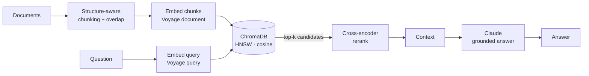

# RAG Playground — Production Retrieval Pipeline

> Hands-on RAG pipeline demonstrating production retrieval techniques: structure-aware chunking, semantic + hybrid search, cross-encoder reranking, and retrieval evaluation. Built with Voyage AI, Claude, and ChromaDB.

[](https://python.org) [](https://anthropic.com) [](https://voyageai.com) [](https://trychroma.com)

## What it does

An end-to-end Retrieval-Augmented Generation pipeline over a document corpus. A question is embedded, the closest chunks are retrieved from a vector store, optionally reranked, and passed to Claude, which answers **strictly from the retrieved context** (grounding) and refuses when the answer isn't there.

Each retrieval technique is implemented as a reusable function in [`rag_core.py`](rag_core.py), and exposed through numbered runner scripts (`01_*` … `06_*`) that demonstrate one stage at a time.

The point of this repo is not just to wire up RAG, but to show **engineering judgment**: every technique is measured, not assumed. Hybrid search, for example, is implemented in full — and then **disabled**, because the evaluation harness showed it hurt quality on this corpus (see [Retrieval evaluation](#retrieval-evaluation)).

The corpus is the documentation of a multi-tenant Telegram-bot SaaS (modules, tech stack, pricing tiers).

## Repository structure

```
rag-playground/
├── rag_core.py          # Reusable pipeline logic — all stages live here
├── 01_chunking.py       # Stage 1: split documents into chunks
├── 02_embeddings.py     # Stage 2: text → vectors (Voyage)
├── 03_search.py         # Stage 3: store in ChromaDB + semantic search
├── 04_rag.py            # Stage 4: full RAG — retrieve + grounded answer
├── 05_rerank.py         # Stage 5: overfetch + cross-encoder reranking
├── 06_eval.py           # Stage 6: retrieval evaluation (Hit@K)
├── data/raw/            # Corpus (markdown docs)
├── requirements.txt
└── .env.example
```

## Pipeline



## Tech stack

| Layer | Technology |
|---|---|
| Language | Python 3.12 |
| Embeddings | Voyage AI — `voyage-4-lite`, 1024-dim, asymmetric query/document |
| Vector store | ChromaDB — HNSW index, cosine distance |
| Reranker | Voyage `rerank-2.5-lite` (cross-encoder) |
| Lexical search | BM25 (`rank_bm25`) |
| Fusion | Reciprocal Rank Fusion (RRF) |
| Generation | Claude `claude-sonnet-4-6` |

## Pipeline stages

- **Structure-aware chunking** — splits on semantic boundaries (paragraphs, tables) instead of fixed character windows, with overlap to survive boundary loss. Switching from naive fixed-size splitting fixed a real bug where a pricing table was torn in half and the model hallucinated the answer.
- **Asymmetric embeddings** — queries and documents are embedded with different `input_type`, the way Voyage is trained to maximize retrieval accuracy.
- **Semantic search** — cosine similarity over an HNSW (approximate nearest neighbor) index in ChromaDB.
- **Cross-encoder reranking** — two-stage retrieval: a cheap bi-encoder overfetches candidates, then a cross-encoder re-scores each (query, chunk) pair jointly. Supports a fixed `top_k` or a dynamic relevance-score threshold.
- **Hybrid retrieval** — dense (semantic) + sparse (BM25) search fused via RRF. Implemented, evaluated, and turned off for this corpus by data.
- **Grounded generation** — Claude answers only from retrieved context and explicitly says when the answer is absent — the core defense against hallucination.

## Retrieval evaluation

Retrieval quality is measured, not eyeballed. [`06_eval.py`](06_eval.py) runs a labeled set of questions, each with a marker that must appear in the correct chunk, and reports **Hit@3** (did the right chunk land in the top 3?).

| Method | Hit@3 |
|---|---|
| Semantic (dense) | **6 / 8** |
| Hybrid (dense + BM25, RRF) | 4 / 8 |

The harness caught a regression invisible to the naked eye: hybrid search *looked* like an upgrade but **lowered** quality on this small, clean corpus — BM25 adds noise and RRF dilutes a chunk that is strong only in the dense channel. Conclusion: keep hybrid in the codebase as a capability, but ship dense-only here. Decision driven by the number, not intuition.

## Code highlights

- [rag_core.py:62](rag_core.py#L62) — `chunk_text`: structure-aware splitting with overlap
- [rag_core.py:174](rag_core.py#L174) — `search`: dense retrieval over ChromaDB (HNSW, cosine)
- [rag_core.py:212](rag_core.py#L212) — `answer`: grounded generation with Claude
- [rag_core.py:244](rag_core.py#L244) — `search_rerank`: overfetch + cross-encoder rerank
- [rag_core.py:317](rag_core.py#L317) — `hybrid_search`: dense + BM25 fused via RRF

## Local setup

```bash
python -m venv .venv
.venv\Scripts\activate          # Windows
pip install -r requirements.txt

copy .env.example .env          # add VOYAGE_API_KEY and ANTHROPIC_API_KEY

python 04_rag.py                # run the full RAG pipeline
python 06_eval.py               # measure retrieval quality
```

API keys: [Voyage AI](https://dash.voyageai.com) (embeddings + reranker), [Anthropic](https://console.anthropic.com) (generation).
